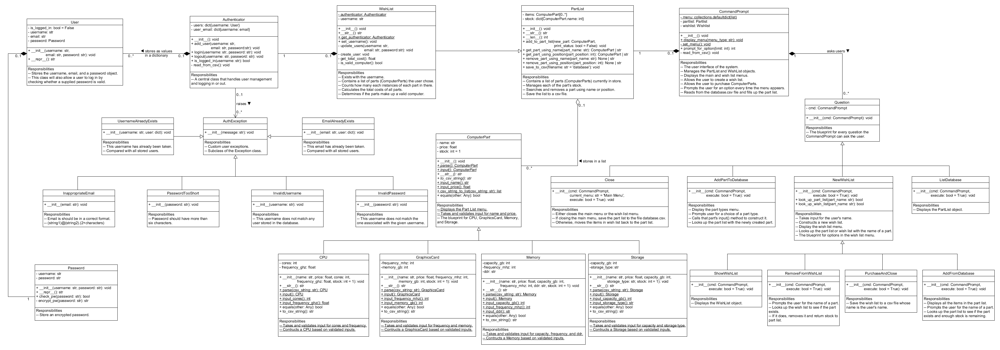

<!-- START doctoc generated TOC please keep comment here to allow auto update -->
<!-- DON'T EDIT THIS SECTION, INSTEAD RE-RUN doctoc TO UPDATE -->
# Table of Contents

- [Aim](#aim)
- [UML Design](#uml-design)
- [Libraries](#libraries)
  - [Standard Library Imports](#standard-library-imports)
  - [Related Third Party Imports](#related-third-party-imports)
- [Implementation](#implementation)
- [Authenticator](#authenticator)
- [Test Driver](#test-driver)
- [Project Organisation](#project-organisation)

<!-- END doctoc generated TOC please keep comment here to allow auto update -->

# Aim

Management of a computer shop, with various stocks stored in the database which
allows users to create a Wishlist.

# UML Design



# Libraries

Note: run pip install -r requirements.txt to get all the required libraries.

Throughout the project, I will use seven standard modules, three third party
ones which require installation via pip.

## Standard Library Imports

1. abc                     <- Implement abstract classes for ComputerPart.
2. collections             <- Call a factory function to supply missing values.
3. csv                     <- Read, write, and append to csv files.
4. getpass                 <- Hidden password as user types.
5. hashlib                 <- Encode user's password stored in the database.
6. random                  <- Randomly pick out an item from a list/tuple.
7. re                      <- Perform regular expression to validate emails.

## Related Third Party Imports

8. icontract               <- Implement design-by-contract.
9. rich.print              <- Override print() built-in method to colourise
                              whatever is printed.
10. rich.console.Console   <- Called using Console().print instead of print to
                              give special types for printed text

# Implementation

ComputerPart class is the abstract classes of four parts sold by the store,
namely CPU, Graphics Card, Memory, and Storage.

Partlist class serves as the database of the store.

Wishlist class is derived from the Partlist, created by the user, with an
additional attribute to store the username.

CommandPrompt class is the user interface which interacts with the user, asking
user questions (derived from the Question class).

# Authenticator

Store user records, including name, email, and password (using hashing
mechanism)so that each user is distinguished and manageable.

Every time a user creates a Wishlist, they will be asked to provide login
details which will be compared with those stored in the user database.

Appropriate errors will be raised and handled to allow only authenticated user
to use the system and control their Wishlist.

# Test Driver

Use pytest to test various methods of the Partlist class.

# Project Organisation

```
├── README.md
├── UML_design.png      <- The diagram showing relationships between classes.
├── authenticator.py    <- Manage user records and perform authentication.
├── database
│.. ├── database.csv    <- All the parts stored in the system.
│   ├── receipts        <- All the receipts of customers buying parts from the store.
│   │   └── henry.csv
│.. └── users.csv       <- All the users (customers) coming to the store.
├── exceptions          <- All exceptions raised by during the authentication process.
│   ├── __init__.py
│   ├── auth_exception.py
│   ├── email_already_exists.py
│   ├── inappropriate_email.py
│   ├── invalid_email.py
│   ├── invalid_password.py
│   ├── invalid_username.py
│   ├── password_too_short.py
│   └── username_already_exists.py
├── main.py             <- The main code of the system.
├── requirements.txt    <- The requirements file for reproducing the analysis environment.
└── test_driver.py      <- Test methods of the Partlist class.
```
